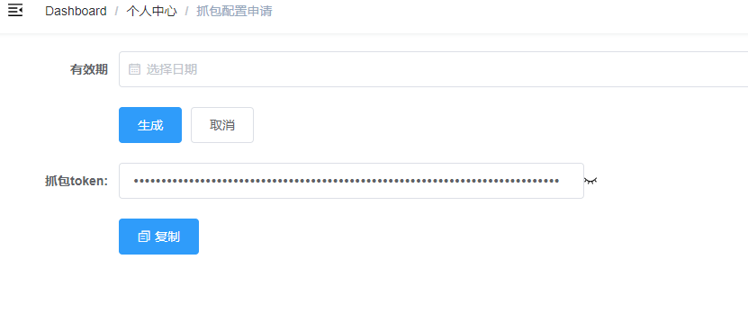
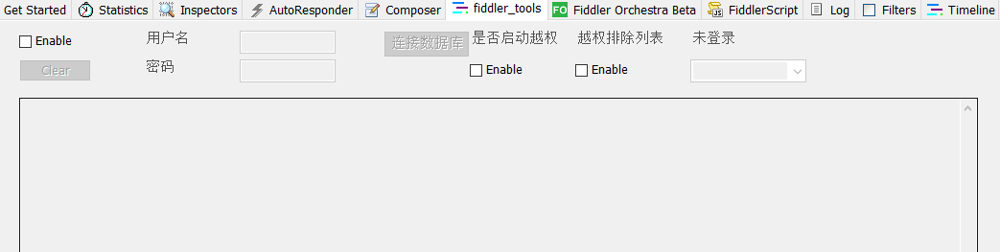
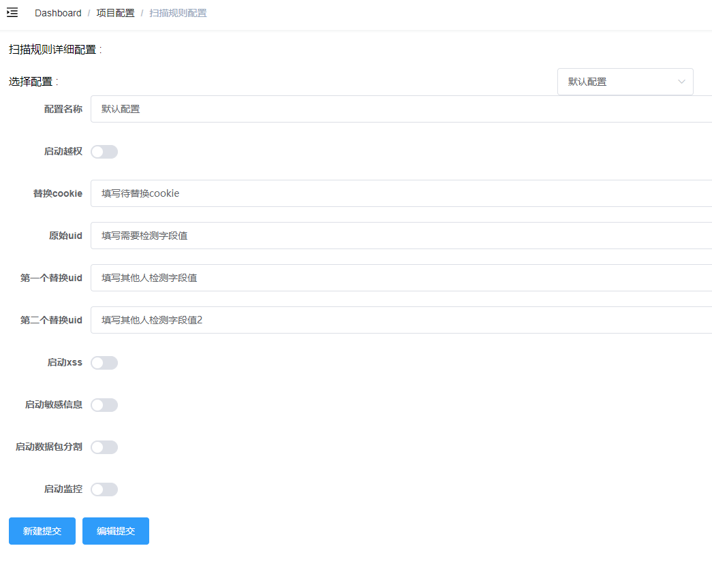

# 被动扫描系统使用说明

## 项目说明

​		被动扫描系统项目,主要功能为通过fiddler插件保存数据包并入库，用户使用web管理界面自定义规则扫描漏洞，漏洞结果扫猫过程中实时展示，目前主要是检测越权和敏感信息检测等模块。

## 使用步骤

1. 注册web后台账号  [注册地址](http://填写自己的域名或ip/#/register)，目前没有做限制

2. 新建项目

   项目名称作为标识用，默认会生成一个default项目。

3. 下载安装fiddler被动扫描插件

   - 安装好fiddler软件。

   - 复制fiddler插件( fiddler_log.dll )到C:\Users\用户名\Documents\Fiddler2\Scripts目录下，该目录初次打开fiddler软件会自动生成。

     填写下载路径

   - 复制插件所需要的json库（ Newtonsoft.Json.dll ）到fiddler安装目录下的Scripts目录下

     填写下载路径

4. 复制web上的抓包token

   

5. fiddler被动扫描插件处启动并选择项目

   - fiddler标签栏找到“fiddler_tools”插件

   

   - 复制从网页端复制的token

    

   - 选择项目

     选择创建过的项目

​			

​	

6. 配置好fiddler代理端口开始抓包，抓包结束

7. 配置具体扫描规则

   在网页端扫描规则配置处可新建、编辑具体规则，下面说明用的“默认规则”

   - 配置名称，必填且不可修改，用作配置标识
   - 越权检测主要分为替换cookie和替换uid两种类型，替换cookie主要是扫描不需要cookie就能成功越权和只是修改cookie就能越权的情况，替换uid是扫描修改数据中指定参数值便能越权情况，可以是天天基金uid、通行证passportid等。
   - 替换cookie：填写替换当前的cookie
   - 原始uid：待检测的字段值
   - 启动敏感信息：检测手机号、身份证、银行卡
   - 启动监控：检测返回包中包含的uid、phone等字段，后续可配置

   

8. 开启扫描

   Dashboard/项目配置/扫描任务启动配置，选择配置之后启动

备注：用户名、密码处已废弃，选择"越权排除列表"表示当前抓取公共页面或者访客用户登录，为了降低访问到新闻页、公开数据页导致的越权检测误报。

